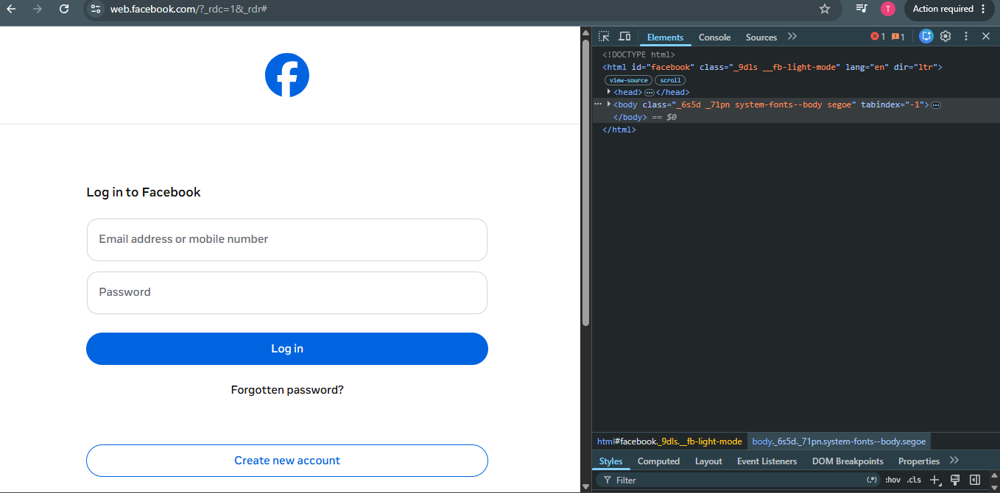

# DevTools Exploration

## Website 1: https://example.com
- **HTML tags used:**
  -  `<html>`
  -  `<head>`
  -  `<title>`
  -  `<body>`
  -  `
`
  -  `<h1>`, `<h2>`
  -  `<a>`
  -  `<links>`
  -  `<Tables>`
  
- **Page title:**  
  Example Domains

- **Number of headings:**  
  2 headings

---

## Website 2: https://developer.mozilla.org
- **Navigation menu tag:**  
  - `<nav>`

- **Search bar structure:**  
  Built with a `<form>` containing an `<input type="search">`

- **Hover effect on links:**  
  When hovering on links it changes the colors

---

## 🌐 Website 3: https://www.facebook,com
- **Five HTML elements identified:**  
  1. `<header>`  
  2. `<footer>`  
  3. `<section>`  
  4. ``  
  5. `<button>`  

- **Form element & inputs:**
  - email field
  - password field
  - submit button  
  
- **Screenshot of Elements panel:**  
  

---

